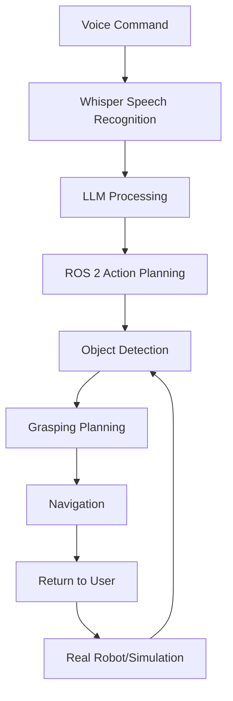

# Capstone Project: Red Cup Detection and Retrieval

This capstone project brings together all the concepts learned throughout the textbook to create a complete voice-controlled humanoid robot system. The goal is to implement a system that can understand the command: "Find the red cup, pick it up, and bring it to me".

## Project Overview

The final system will integrate:
- Voice command processing using Whisper and LLMs
- Computer vision for red cup detection
- Motion planning and manipulation for grasping
- Navigation to return the object to the user

## Learning Objectives

By completing this project, you will:
- Integrate all four modules into a cohesive system
- Implement end-to-end voice-to-action pipeline
- Deploy and test the system in both simulation and real hardware

## System Architecture



## Implementation Steps

### 1. Voice Command Processing

First, let's implement the voice-to-text component:

```python
import whisper
import rclpy
from rclpy.node import Node
from std_msgs.msg import String

class VoiceCommandNode(Node):
    def __init__(self):
        super().__init__('voice_command_node')
        self.publisher_ = self.create_publisher(String, 'voice_commands', 10)
        # Initialize Whisper model
        self.model = whisper.load_model("base")

    def process_audio(self, audio_file):
        result = self.model.transcribe(audio_file)
        command = result["text"]
        self.get_logger().info(f'Detected command: {command}')
        return command
```

### 2. Object Detection

Implement open-vocabulary detection for identifying the red cup:

```python
from transformers import pipeline
import cv2

class ObjectDetectionNode(Node):
    def __init__(self):
        super().__init__('object_detection_node')
        # Initialize Grounding DINO + SAM pipeline
        self.detector = pipeline("object-detection", model="IDEA-Research/grounding-dino-base")

    def detect_red_cup(self, image):
        # Detect objects matching "red cup" description
        results = self.detector(image, candidate_labels=["red cup"])
        return results
```

### 3. Grasping and Navigation

Plan the grasping motion and navigation:

```python
import moveit_commander
from nav2_simple_commander.robot_navigator import BasicNavigator

class RobotControllerNode(Node):
    def __init__(self):
        super().__init__('robot_controller_node')
        # Initialize MoveIt 2 for manipulation
        self.moveit = moveit_commander.MoveGroupCommander("manipulator")
        # Initialize Nav2 for navigation
        self.nav = BasicNavigator()

    def plan_grasp_and_retrieve(self, object_pose):
        # Plan path to object
        self.nav.go_to_pose(object_pose)
        # Execute grasp using MoveIt
        self.moveit.go()
        # Return to user
        self.nav.go_to_pose(user_pose)
```

## Interactive Exercise

Try the complete pipeline in simulation:

```starboard
print("Complete voice-controlled humanoid robot system ready!")
print("This would execute the full pipeline in a simulated environment.")
```

## Testing the System

Create a launch file to start the complete system:

```xml
<!-- static/launch/voice_command_demo.launch.py -->
from launch import LaunchDescription
from launch_ros.actions import Node
from ament_index_python.packages import get_package_share_directory

def generate_launch_description():
    return LaunchDescription([
        Node(
            package='voice_processing',
            executable='voice_command_node',
            name='voice_command'
        ),
        Node(
            package='object_detection',
            executable='object_detector_node',
            name='object_detector'
        ),
        Node(
            package='robot_control',
            executable='robot_controller_node',
            name='robot_controller'
        )
    ])
```

## Deployment on Real Hardware

For deployment on real hardware with a Jetson Orin:

1. Optimize models using TensorRT
2. Ensure proper power management
3. Calibrate sensors and actuators
4. Test in controlled environment

## Summary

This capstone project demonstrates the complete integration of all concepts covered in the textbook. The voice-controlled humanoid robot system represents the culmination of ROS 2 fundamentals, simulation, AI brain, and vision-language-action capabilities.